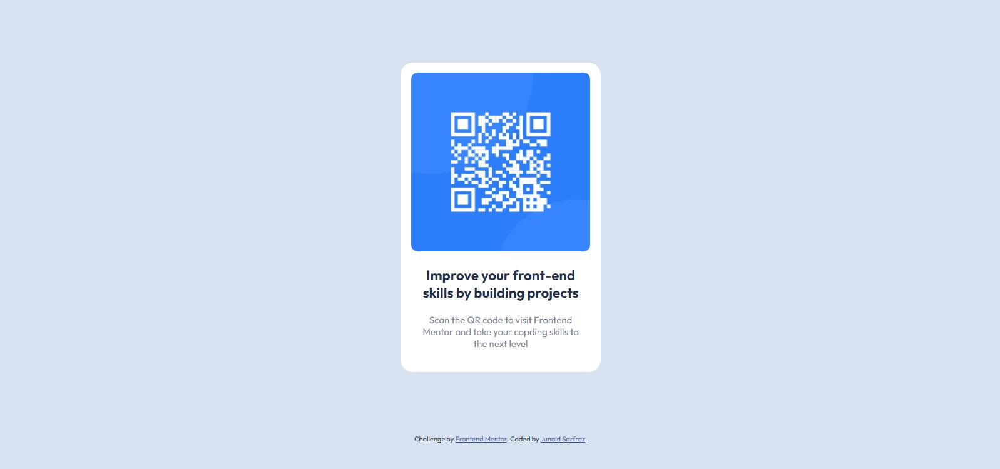

# Frontend Mentor - QR code component solution

This is a solution to the [QR code component challenge on Frontend Mentor](https://www.frontendmentor.io/challenges/qr-code-component-iux_sIO_H). Frontend Mentor challenges help you improve your coding skills by building realistic projects.

## Table of contents

- [Overview](#overview)
  - [Screenshot](#screenshot)
  - [Links](#links)
- [My process](#my-process)
  - [Built with](#built-with)
  - [What I learned](#what-i-learned)
  - [Useful resources](#useful-resources)
- [Author](#author)

## Overview

### Screenshot



### Links

- Solution URL: [GitHub](https://github.com/junaidsmj/qr-code-component-main)
- Live URL : [Live](https://junaidsmj.github.io/qr-code-component-main/)

## My process

### Built with

- Semantic HTML5 markup
- CSS custom properties-

### What I learned

I learned that border-radius takes effect on the padding too. I added padding-bottom on the img therefore border-radius wasn't effecting the image from the bottom.

To see how you can add code snippets, see below:

```css
img {
  width: 286px;
  height: auto;
  border-radius: 10px;
}
```

### Useful resources

- [Example resource 1](https://www.w3schools.com/) - This helped me understand padding, root variables and border-radius.

## Author

- Frontend Mentor - [@junaidsmj](https://www.frontendmentor.io/profile/junaidsmj)
